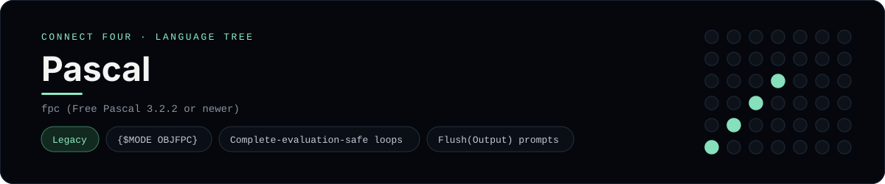

# Pascal Implementation

Free Pascal in OBJFPC mode, with explicit short-circuit-free trim loops - one of 42 implementations of the same console protocol in the
[Neo-Connect-Four-Language-Tree](../../README.md) repository. Every
implementation reads the same stdin and prints byte-for-byte identical
output, so a single master test verifies them all at once.

## Prerequisites

* **Toolchain:** fpc (Free Pascal 3.2.2 or newer)
* **Check it is installed:** `fpc -iV`

| Platform | Install command |
| --- | --- |
| Windows | `scoop install freepascal` |
| macOS | `brew install fpc` |
| Debian/Ubuntu | `apt-get install fpc` |

## How to run

Build this implementation and replay every scenario (from the repository
root):

```sh
python tests/run_tests.py
```

Build and play it on its own:

```sh
fpc -O2 -FUtests/build/pascal -FEtests/build/pascal languages/pascal/connect_four.pas
./tests/build/pascal/connect_four
```

### Notes

* On Windows the built program is `tests/build/pascal/connect_four.exe`; on other platforms the `.exe` suffix is dropped.
* Scoop's Free Pascal is the i386 build, which is fine - the 32-bit executable runs on x64 Windows.
* `fpc` will not create its `-FU`/`-FE` directories, so the runner makes `tests/build/pascal` first; without that the compiler stops with an error rather than creating the path.
* `and then` is not available in OBJFPC mode and `and` evaluates both sides, so the trim loops break out explicitly instead of indexing past the end of an empty string.

## Skills demonstrated

* {$MODE OBJFPC}
* Complete-evaluation-safe loops
* Flush(Output) prompts

## Verified output

The runner replays the eight scripted sessions in
[`tests/inputs/`](../../tests/inputs) and compares stdout with the goldens in
[`tests/expected/`](../../tests/expected) byte for byte. It then checks that
the prompt appears before each read while stdin is still open, which is what
separates an interactive program from one that swallows its input up front.
`languages/pascal/connect_four.pas` is the only file this implementation needs.

## Protocol

[`README.md`](../../README.md#console-protocol) documents the console
protocol exactly, and [`tests/run_tests.py`](../../tests/run_tests.py) holds
the build and run commands the suite uses for every language. The showcase
dashboard shows this implementation at `index.html?lang=pascal`.

This README and its banner are generated by
[`tools/generate_language_readmes.py`](../../tools/generate_language_readmes.py),
which reads the runner's own metadata - so re-run that script rather than
editing them by hand.
