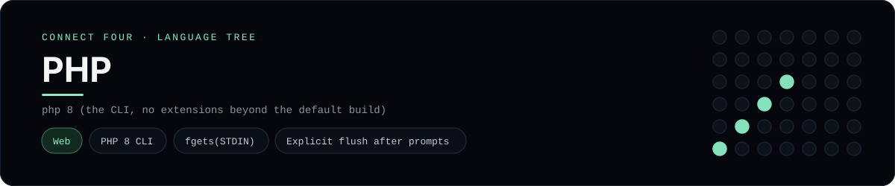

# PHP Implementation

PHP 8 reading STDIN with fgets and flushing after every prompt - one of 41 implementations of the same console protocol in the
[Neo-Connect-Four-Language-Tree](../../README.md) repository. Every
implementation reads the same stdin and prints byte-for-byte identical
output, so a single master test verifies them all at once.

## Prerequisites

* **Toolchain:** php 8 (the CLI, no extensions beyond the default build)
* **Check it is installed:** `php --version`

| Platform | Install command |
| --- | --- |
| Windows | `winget install PHP.PHP.8.3 (or unpack the official zip)` |
| macOS | `brew install php` |
| Debian/Ubuntu | `apt-get install php-cli` |

## How to run

Build this implementation and replay every scenario (from the repository
root):

```sh
python tests/run_tests.py
```

Play it on its own:

```sh
php languages/php/connect_four.php
```

### Notes

* The blank-cell constant is called `EMPTY_CELL`, because `EMPTY` is a reserved construct in PHP (`empty()`).
* The Windows binaries are plain archives or an install package; the runner's `php_env()` only prepends a PHP directory to `PATH` when one is not already there.

## Skills demonstrated

* PHP 8 CLI
* fgets(STDIN)
* Explicit flush after prompts

## Verified output

The runner replays the eight scripted sessions in
[`tests/inputs/`](../../tests/inputs) and compares stdout with the goldens in
[`tests/expected/`](../../tests/expected) byte for byte. It then checks that
the prompt appears before each read while stdin is still open, which is what
separates an interactive program from one that swallows its input up front.
`languages/php/connect_four.php` is the only file this implementation needs.

## Protocol

[`README.md`](../../README.md#console-protocol) documents the console
protocol exactly, and [`tests/run_tests.py`](../../tests/run_tests.py) holds
the build and run commands the suite uses for every language. The showcase
dashboard shows this implementation at `index.html?lang=php`.

This README and its banner are generated by
[`tools/generate_language_readmes.py`](../../tools/generate_language_readmes.py),
which reads the runner's own metadata - so re-run that script rather than
editing them by hand.
