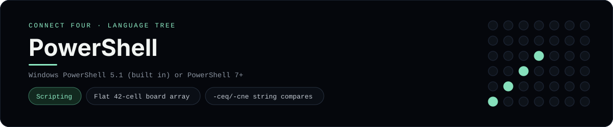

# PowerShell Implementation

Windows PowerShell with a flat 42-cell array board - one of 44 implementations of the same console protocol in the
[Neo-Connect-Four-Language-Tree](../../README.md) repository. Every
implementation reads the same stdin and prints byte-for-byte identical
output, so a single master test verifies them all at once.

## Prerequisites

* **Toolchain:** Windows PowerShell 5.1 (built in) or PowerShell 7+
* **Check it is installed:** `powershell -Command '$PSVersionTable.PSVersion'`

| Platform | Install command |
| --- | --- |
| Windows | `built in with Windows; choco install powershell-core for PowerShell 7` |
| macOS | `brew install --cask powershell` |
| Debian/Ubuntu | `apt-get install powershell` |

## How to run

Build this implementation and replay every scenario (from the repository
root):

```sh
python tests/run_tests.py
```

Play it on its own:

```sh
powershell -NoProfile -ExecutionPolicy Bypass -File languages/powershell/connect_four.ps1
```

### Notes

* The board is a flat 42-cell array, which sidesteps PowerShell's array unrolling when a function returns a nested array.
* Variable names are case-insensitive, so a loop-local `$row`/`$column` inside a function whose parameters are `-Row`/`-Column` is the *same* variable and overwrites the parameter; the locals are named `$targetRow`/`$targetColumn` instead. `-eq`/`-ne` are case-insensitive for strings too, so the board comparisons use `-ceq`/`-cne`.
* Output goes through `[Console]::Out.Write` rather than `Write-Output`/`Write-Host`, so the newline-free prompt reaches the pipe before the read.

## Skills demonstrated

* Flat 42-cell board array
* -ceq/-cne string compares
* [long]::MaxValue saturating parse

## Verified output

The runner replays the eight scripted sessions in
[`tests/inputs/`](../../tests/inputs) and compares stdout with the goldens in
[`tests/expected/`](../../tests/expected) byte for byte. It then checks that
the prompt appears before each read while stdin is still open, which is what
separates an interactive program from one that swallows its input up front.
`languages/powershell/connect_four.ps1` is the only file this implementation needs.

## Protocol

[`README.md`](../../README.md#console-protocol) documents the console
protocol exactly, and [`tests/run_tests.py`](../../tests/run_tests.py) holds
the build and run commands the suite uses for every language. The showcase
dashboard shows this implementation at `index.html?lang=powershell`.

This README and its banner are generated by
[`tools/generate_language_readmes.py`](../../tools/generate_language_readmes.py),
which reads the runner's own metadata - so re-run that script rather than
editing them by hand.
