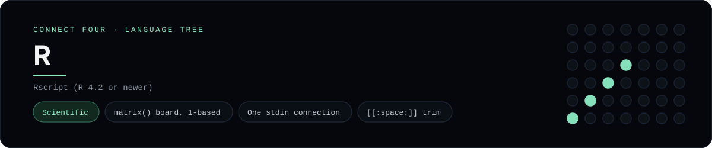

# R Implementation

R with a 1-based matrix board and a single stdin connection - one of 42 implementations of the same console protocol in the
[Neo-Connect-Four-Language-Tree](../../README.md) repository. Every
implementation reads the same stdin and prints byte-for-byte identical
output, so a single master test verifies them all at once.

## Prerequisites

* **Toolchain:** Rscript (R 4.2 or newer)
* **Check it is installed:** `Rscript --version`

| Platform | Install command |
| --- | --- |
| Windows | `scoop install r` |
| macOS | `brew install r` |
| Debian/Ubuntu | `apt-get install r-base` |

## How to run

Build this implementation and replay every scenario (from the repository
root):

```sh
python tests/run_tests.py
```

Play it on its own:

```sh
Rscript --vanilla languages/r/connect_four.R
```

### Notes

* Reading stdin incrementally in a script needs a connection opened once at the top (`input_stream <- file("stdin", "r")`) and then `readLines(input_stream, n = 1)`; `readLines("stdin", n = 1)`, `scan("stdin", ...)` and `stdin()` each reopen the pseudo-file and report EOF on the second call, while `readline()` does not read piped stdin under `Rscript` at all.
* `--vanilla` keeps site and user profiles, and any saved workspace, out of the run; `character(0)` is the end-of-input signal, which is how EOF is told apart from an empty line.

## Skills demonstrated

* matrix() board, 1-based
* One stdin connection
* [[:space:]] trim

## Verified output

The runner replays the eight scripted sessions in
[`tests/inputs/`](../../tests/inputs) and compares stdout with the goldens in
[`tests/expected/`](../../tests/expected) byte for byte. It then checks that
the prompt appears before each read while stdin is still open, which is what
separates an interactive program from one that swallows its input up front.
`languages/r/connect_four.R` is the only file this implementation needs.

## Protocol

[`README.md`](../../README.md#console-protocol) documents the console
protocol exactly, and [`tests/run_tests.py`](../../tests/run_tests.py) holds
the build and run commands the suite uses for every language. The showcase
dashboard shows this implementation at `index.html?lang=r`.

This README and its banner are generated by
[`tools/generate_language_readmes.py`](../../tools/generate_language_readmes.py),
which reads the runner's own metadata - so re-run that script rather than
editing them by hand.
