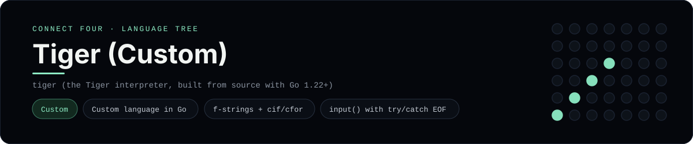

# Tiger (Custom) Implementation

Tiger, a custom programming language written in Go, using f-strings, C-style `cif`/`cfor` and `input()` - one of 44 implementations of the same console protocol in the
[Neo-Connect-Four-Language-Tree](../../README.md) repository. Every
implementation reads the same stdin and prints byte-for-byte identical
output, so a single master test verifies them all at once.

## Prerequisites

* **Toolchain:** tiger (the Tiger interpreter, built from source with Go 1.22+)
* **Check it is installed:** `tiger help`

| Platform | Install command |
| --- | --- |
| Windows | `git clone https://github.com/pattygcoding/Tiger-Programming-Language; cd Tiger-Programming-Language; go build -o bin/tiger.exe ./cmd/tiger` |
| macOS | `git clone https://github.com/pattygcoding/Tiger-Programming-Language && cd Tiger-Programming-Language && go build -o bin/tiger ./cmd/tiger` |
| Debian/Ubuntu | `git clone https://github.com/pattygcoding/Tiger-Programming-Language && cd Tiger-Programming-Language && go build -o bin/tiger ./cmd/tiger` |

## How to run

Build this implementation and replay every scenario (from the repository
root):

```sh
python tests/run_tests.py
```

Play it on its own:

```sh
tiger run languages/tiger/connect_four.tg
```

### Notes

* Tiger is a custom programming language by Patrick Goodwin: a dynamically typed, tree-walking interpreter written in Go with no third-party dependencies. Source: [pattygcoding/Tiger-Programming-Language](https://github.com/pattygcoding/Tiger-Programming-Language).
* Try it in the browser at [Tiger Language - Patrick Goodwin](https://www.pattygcoding.com/tiger), a WebAssembly build of the same interpreter.
* Tiger has no package-manager release, so the runner uses `tiger` from `PATH` and otherwise `bin/tiger` in a sibling `Tiger-Programming-Language` checkout.
* `input()` throws at end of input, so the `catch` is what prints `Input closed. Goodbye.`; `tiger build` could also bundle the script into a standalone executable, but the suite runs it with `tiger run`.

## Skills demonstrated

* Custom language in Go
* f-strings + cif/cfor
* input() with try/catch EOF

## Verified output

The runner replays the eight scripted sessions in
[`tests/inputs/`](../../tests/inputs) and compares stdout with the goldens in
[`tests/expected/`](../../tests/expected) byte for byte. It then checks that
the prompt appears before each read while stdin is still open, which is what
separates an interactive program from one that swallows its input up front.
`languages/tiger/connect_four.tg` is the only file this implementation needs.

## Protocol

[`README.md`](../../README.md#console-protocol) documents the console
protocol exactly, and [`tests/run_tests.py`](../../tests/run_tests.py) holds
the build and run commands the suite uses for every language. The showcase
dashboard shows this implementation at `index.html?lang=tiger`.

This README and its banner are generated by
[`tools/generate_language_readmes.py`](../../tools/generate_language_readmes.py),
which reads the runner's own metadata - so re-run that script rather than
editing them by hand.
