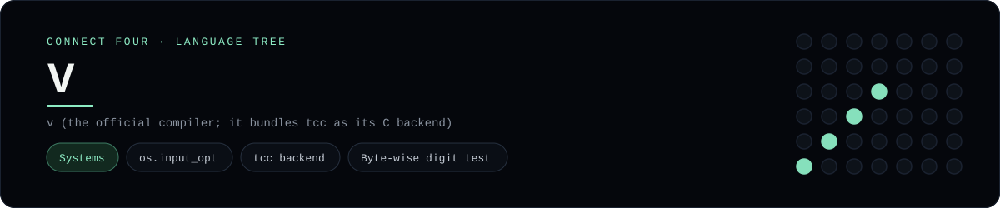

# V Implementation

V with os.input_opt, which distinguishes an empty line from end of input - one of 40 implementations of the same console protocol in the
[Neo-Connect-Four-Language-Tree](../../README.md) repository. Every
implementation reads the same stdin and prints byte-for-byte identical
output, so a single master test verifies them all at once.

## Prerequisites

* **Toolchain:** v (the official compiler; it bundles tcc as its C backend)
* **Check it is installed:** `v version`

| Platform | Install command |
| --- | --- |
| Windows | `the official v_windows.zip, unpacked to C:\tools\v` |
| macOS | `brew install v` |
| Debian/Ubuntu | `the distro package, or build from source` |

## How to run

Build this implementation and replay every scenario (from the repository
root):

```sh
python tests/run_tests.py
```

Build and play it on its own:

```sh
v -o tests/build/connect_four_v languages/v/connect_four.v
./tests/build/connect_four_v
```

### Notes

* On Windows the built program is `tests/build/connect_four_v.exe`; on other platforms the `.exe` suffix is dropped.
* `os.input_opt(prompt)` is exactly the primitive this needs: it prints the prompt verbatim, flushes immediately, strips a trailing `\r\n`, and returns `none` at end of input versus `''` for an empty line.
* The release asset is `v_windows.zip` (not `v_win.zip`) and it nests everything one level down; it bundles `tcc`, so no external C compiler is required.

## Skills demonstrated

* os.input_opt
* tcc backend
* Byte-wise digit test

## Verified output

The runner replays the eight scripted sessions in
[`tests/inputs/`](../../tests/inputs) and compares stdout with the goldens in
[`tests/expected/`](../../tests/expected) byte for byte. It then checks that
the prompt appears before each read while stdin is still open, which is what
separates an interactive program from one that swallows its input up front.
`languages/v/connect_four.v` is the only file this implementation needs.

## Protocol

[`README.md`](../../README.md#console-protocol) documents the console
protocol exactly, and [`tests/run_tests.py`](../../tests/run_tests.py) holds
the build and run commands the suite uses for every language. The showcase
dashboard shows this implementation at `index.html?lang=v`.

This README and its banner are generated by
[`tools/generate_language_readmes.py`](../../tools/generate_language_readmes.py),
which reads the runner's own metadata - so re-run that script rather than
editing them by hand.
