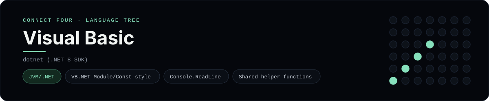

# Visual Basic Implementation

VB.NET console app with Const/ReadOnly module state - one of 44 implementations of the same console protocol in the
[Neo-Connect-Four-Language-Tree](../../README.md) repository. Every
implementation reads the same stdin and prints byte-for-byte identical
output, so a single master test verifies them all at once.

## Prerequisites

* **Toolchain:** dotnet (.NET 8 SDK)
* **Check it is installed:** `dotnet --version`

| Platform | Install command |
| --- | --- |
| Windows | `winget install Microsoft.DotNet.SDK.8` |
| macOS | `brew install dotnet-sdk` |
| Debian/Ubuntu | `apt-get install dotnet-sdk-8.0` |

## How to run

Build this implementation and replay every scenario (from the repository
root):

```sh
python tests/run_tests.py
```

Build and play it on its own:

```sh
dotnet build languages/vb/ConnectFour.vbproj -c Release -o tests/build/vb --nologo -v quiet
dotnet tests/build/vb/connect_four_vb.dll
```

### Notes

* `ConnectFour.vbproj` next to the source is the project file, and it compiles with the same .NET SDK as the C# and F# entries.

## Skills demonstrated

* VB.NET Module/Const style
* Console.ReadLine
* Shared helper functions

## Verified output

The runner replays the eight scripted sessions in
[`tests/inputs/`](../../tests/inputs) and compares stdout with the goldens in
[`tests/expected/`](../../tests/expected) byte for byte. It then checks that
the prompt appears before each read while stdin is still open, which is what
separates an interactive program from one that swallows its input up front.
Everything this implementation needs lives in `languages/vb/`.

## Protocol

[`README.md`](../../README.md#console-protocol) documents the console
protocol exactly, and [`tests/run_tests.py`](../../tests/run_tests.py) holds
the build and run commands the suite uses for every language. The showcase
dashboard shows this implementation at `index.html?lang=vb`.

This README and its banner are generated by
[`tools/generate_language_readmes.py`](../../tools/generate_language_readmes.py),
which reads the runner's own metadata - so re-run that script rather than
editing them by hand.
