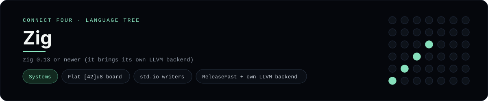

# Zig Implementation

Zig with a flat []u8 board and direct stdout writes - one of 42 implementations of the same console protocol in the
[Neo-Connect-Four-Language-Tree](../../README.md) repository. Every
implementation reads the same stdin and prints byte-for-byte identical
output, so a single master test verifies them all at once.

## Prerequisites

* **Toolchain:** zig 0.13 or newer (it brings its own LLVM backend)
* **Check it is installed:** `zig version`

| Platform | Install command |
| --- | --- |
| Windows | `choco install zig` |
| macOS | `brew install zig` |
| Debian/Ubuntu | `apt-get install zig (newer releases)` |

## How to run

Build this implementation and replay every scenario (from the repository
root):

```sh
python tests/run_tests.py
```

Build and play it on its own:

```sh
cd tests/build
zig build-exe -O ReleaseFast --name connect_four_zig ../../languages/zig/connect_four.zig
./connect_four_zig
```

### Notes

* On Windows the built program is `connect_four_zig.exe`; on other platforms the `.exe` suffix is dropped.
* `zig build-exe` writes the `--name` verbatim and rejects a `.exe` in `-femit-bin`, so the runner builds with `cwd=tests/build` and `--name connect_four_zig` to land `connect_four_zig.exe` where it expects it - the commands above do the same by starting with `cd tests/build`.

## Skills demonstrated

* Flat [42]u8 board
* std.io writers
* ReleaseFast + own LLVM backend

## Verified output

The runner replays the eight scripted sessions in
[`tests/inputs/`](../../tests/inputs) and compares stdout with the goldens in
[`tests/expected/`](../../tests/expected) byte for byte. It then checks that
the prompt appears before each read while stdin is still open, which is what
separates an interactive program from one that swallows its input up front.
`languages/zig/connect_four.zig` is the only file this implementation needs.

## Protocol

[`README.md`](../../README.md#console-protocol) documents the console
protocol exactly, and [`tests/run_tests.py`](../../tests/run_tests.py) holds
the build and run commands the suite uses for every language. The showcase
dashboard shows this implementation at `index.html?lang=zig`.

This README and its banner are generated by
[`tools/generate_language_readmes.py`](../../tools/generate_language_readmes.py),
which reads the runner's own metadata - so re-run that script rather than
editing them by hand.
